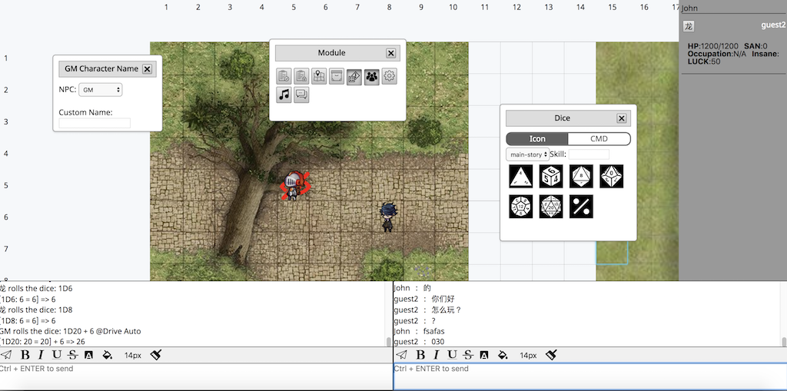

## Channel Module

There are two types of channel: Story Channel and Chat Channel. Display name in chat channel will be user name, while in story channel it will be displayed as character name. GM could switch the character name via “GM Character Name” Module; Player could switch the character name by changing controlled character. If the player doesn’t have controlled character, the display name in story channel will be player name

- a. Send the message
- b. Bold
- c. Italic
- d. Underline
- e. Font color
- f. Background color
- g. Font size
- h. Clear the format
- i. Display name: when the user is is typing in story channel, it will show the current display on the top right side

## Dialog

Most of the modules in Role-Playing Game Web are displayed as dialog, it is similar as what you are playing in any RPG PC game, which is draggable and resizable

- a. Title：Dialogs could be draggad by pressing title
- b. Close the dialog

## Admin Module

The module to open/close other dialogs. There are Public Note Module, Private Note Module, Map Admin Module, Item Admin Module, Dice Module, “GM Character Name Module”, Configure, BGM Module and Private Channel Module, The detail of each module will be displayed as following

## Public Note Module

### Index

### Note Admin Module
