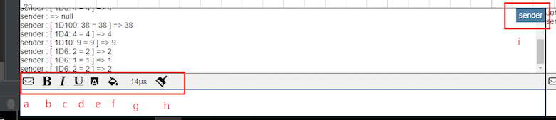
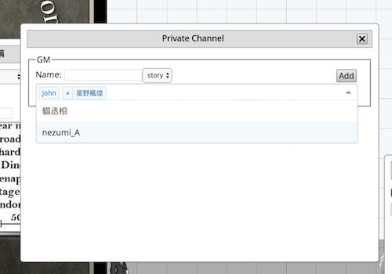
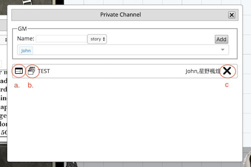

# 頻道系統

## 主要頻道

頻道分為兩種,劇情頻道以及聊天頻道．聊天頻道的顯示名稱為玩家名字，進入房間後是無法修正的；劇情頻道的顯示名稱為角色名字，GM可以經由GM專門的角色切換器切換名稱，玩家若沒有創建或是設定操作角色（請參考玩家以及角色欄位）的話一開始是顯示玩家名字，若已經設定好角色，顯示名稱則會是該角色名稱

## 頻道功能

- 送出訊息(a): 另外也可以使用Ctrl+Enter送出
- 粗體(b)
- 斜體(c)
- 底線(d)
- 文字顏色(e)
- 背景顏色(f)
- 文字大小(g)
- 清除格式(h)
- 顯示名稱(i)：當送出訊息後會顯示在頻道上的名字，為劇情頻道專有功能

## 第三方頻道

第三方頻道(或稱私訊頻道)可以讓GM開心的頻道，並且限定可以瀏覽的成員。

### 開啟新的頻道(GM限定功能)

若GM想要開啟新的頻道，在上方打上頻道名稱，選取有權限的玩家，以及頻道類性(故事或是聊天)，最後再點擊新增即可。
新增的頻道會以列表方式顯示在下方

### 頻道列表

- 以新視窗格式顯示第三方頻道(a)
- 以新分頁格式顯示第三方頻道(b)
- 刪除該頻道(c)

### 第三方頻道視窗

第三方頻道的操作模式跟一般的視窗操作介面一樣
