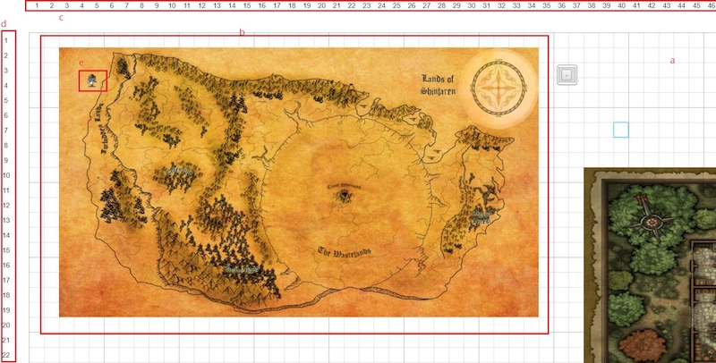

# 棋盤以及地圖

TRPG網頁版的地圖系統以棋盤為基底，GM可將複數地圖貼在棋盤上，並且把物件(詳見物件控制台)移到地圖上產生Token

## 棋盤

- 棋盤(a)：大小為200X200的棋盤，可利用滑鼠拖拉來進行移動
- 地圖(b)：ＧＭ可由地圖控制台做控制，資料或是更新可以參考[地圖控制台](map.md)
- Ｘ軸(c)
- Ｙ軸(d)
- Token(e): 可藉由滑鼠拖拉來移動或是控制大小
- 利用滑鼠滾輪可以調整棋盤的大小

## 地圖

## Token

## Token 選單

