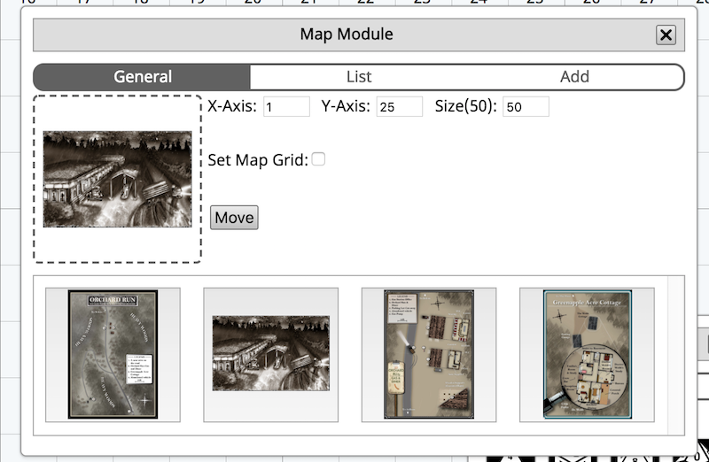
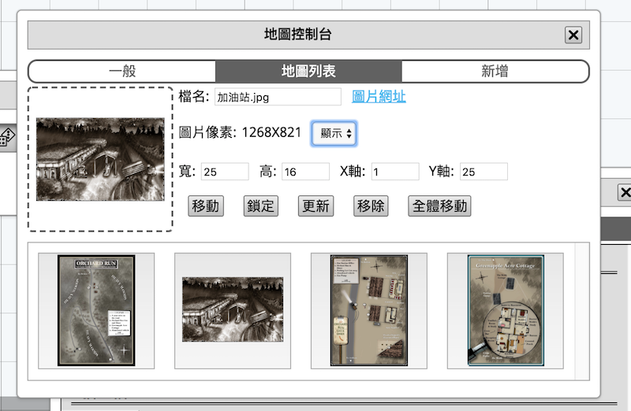
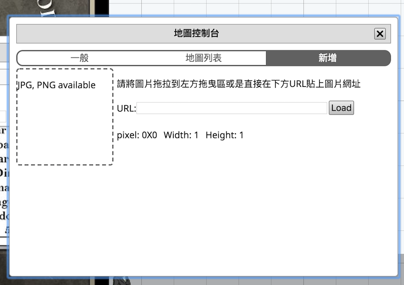

# 地圖控制台

GM以及玩家用來操作棋盤和地圖的視窗．有分為三個頁面：一般頁面，地圖列表以及上傳頁面，而在下方則是顯示GM已上傳的地圖

## 一般頁面

- 在一般頁面上有顯示X軸Y軸的數值，填入數字並按下移動按鈕後棋盤便會自動移動到該地位置上
- size顯示的是目前一個格子的大小，調整後棋盤格子的大小會隨數值改變，預設為50, 可輸入的範圍為20-150。
也可以在棋盤上使用滑鼠滾輪來調整大小
- 顯示地圖格線：勾選後棋盤上的地圖就會顯示格線了
- 地圖表單： GM上傳的圖會顯示在此, 點擊圖片會會跳轉到該圖片的訊息

## 地圖列表

若在表單上點擊任何一個地圖就會自動切到表單頁面，這個頁面允許玩家查看該地圖的資料以及GM更新該地圖的資料。上圖顯示的是GM的畫面，若在玩家視角則上圖所有資料皆為唯讀

- 檔名(玩家視角唯讀): 該地圖的顯示名稱
- 圖片網址
- 圖片像素
- 寬高 (玩家視角唯讀): 該地圖在棋盤上的格子長度
- XY軸(玩家視角唯讀): 該地圖在棋盤上的位置

- 移動按鈕：點擊該按鈕棋盤就會自動移動到該地圖上
- 更新按鈕(GM限定功能)：若GM想更新資料，只要將上方可輸入的資料後修改在點擊更新按鈕即可更新
- 移除按鈕(GM限定功能): 移除該地圖
- 全體移動按鈕(GM限定功能)： 點擊該按鈕後所有玩家的棋盤都會自動移動到該地圖上

## 上傳頁面(GM限定功能)

TRPG網頁版允許GM上傳自己的地圖到房間裡面，上傳方法有兩種

### 1. 將本地端的圖上傳到房間

將圖片直接拖進左方的拖曳區後會產生資料，修改後上傳即可

### 2. 將已經在網路上的圖上傳到房間(直連網址限定)

將圖片直連網址貼近URL立面並且讀取，之後修改後上傳

