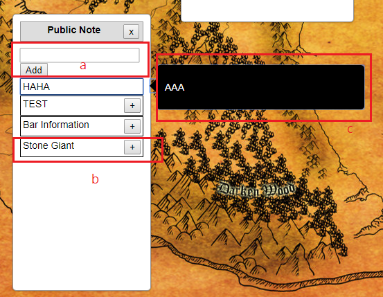
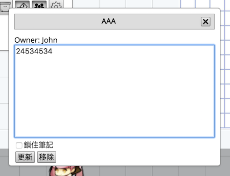

# 筆記系統

網頁版筆記有分成**共用筆記**以及**私人筆記**兩種, 公共筆記為所有人皆可看到的內容, 而只有持有人可以見到私人筆記. ＧＭ可將劇本事先存取在這個地方，如果ＧＭ想要把私人筆記複製至公共筆記，可以點選＂複製至共用筆記＂就會自動拷貝一份至共用筆記了

## 筆記控制台

### 開新筆記(a)

在筆記控制台上方的輸入框打入標題按新增即可

### 筆記標題(b)

當新增筆記標題之後，新的筆記會自動列在下方列表的最下方，點擊標題的話就會顯示筆記內文，
而點擊＋按鈕則會跳出筆記內文控制台用以修改該筆筆記內容

### 筆記內文提示框(c)

在筆記控制台上點擊該筆記右方就會跳出黑色框跟筆記內容了

## 筆記內文控制台

### 更新筆記內容

在要更新的那筆筆記上點擊＋號按鈕, 打開後即可修改內容以及更新

**筆記內容支援MD語法，粗斜體，圖片等等**，教學在[這裏](md-syntax.md)

### 鎖住筆記(共用筆記功能)

鎖住後只有持有者以及ＧＭ可以修改筆記內容，

### 複製至共用筆記(私人筆記功能)

當點擊此按鈕後，這份筆記便會複製一份至共用筆記

### 刪除筆記

打開該筆筆記資料，點擊刪除按鈕即可刪除該筆記

