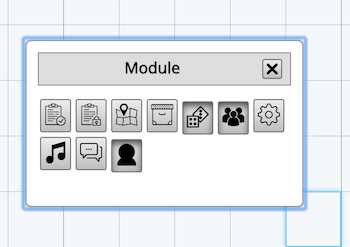

# TRPG網頁版教學文件

## 控制台

用來開啟或是關閉各類模組，由左到右分別為公共筆記，私人筆記，地圖控制台，Item控制台，
骰子控制台，GM顯示名稱控制台, 房間設定, BGM控制台, 私訊頻道控制台, 立繪序列系統。詳細介紹之後一一介紹

## [筆記系統](./note.md)

## [頻道系統](./channel.md)

## 擲骰系統

- [延伸：骰子指令規則](roll.md)

## 棋盤以及地圖

## 立繪/序列系統

## BGM系統

## 物件系統
